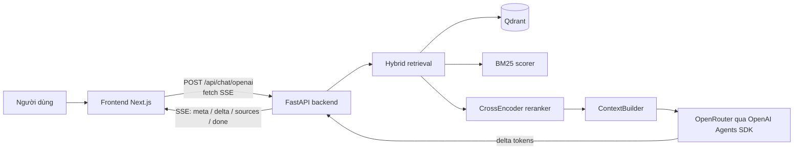
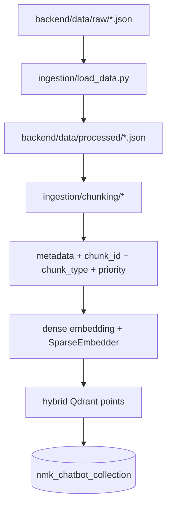

# NMK RAG Chatbot

Chatbot RAG trả lời thông tin về Nguyen Minh Khang Architects dựa trên dữ liệu nội bộ của công ty. Dự án dùng Python FastAPI cho backend, Qdrant làm vector database, hybrid retrieval kết hợp dense embedding + BM25, reranking bằng CrossEncoder và frontend Next.js để chat theo dạng SSE streaming.

Backend chính hiện nằm trong thư mục `backend/`. Frontend gọi endpoint `POST /api/chat/openai`, nhận phản hồi `text/event-stream` và render Markdown trực tiếp trong lúc mô hình đang sinh câu trả lời.

## Tính Năng Chính

- Ingestion pipeline đọc dữ liệu JSON, tách bảng, chunking theo ngữ nghĩa và upsert vào Qdrant.
- Vector store dùng schema hybrid gồm named vector `dense` và sparse vector `sparse`.
- Retrieval chính dùng dense search qua Qdrant, BM25 score và trộn điểm hybrid.
- Reranking bằng CrossEncoder trước khi build context cho LLM.
- Endpoint OpenRouter dùng OpenAI Agents SDK và stream câu trả lời qua SSE.
- Frontend Next.js nhận SSE bằng `fetch()`, hiển thị delta theo thời gian thực và render Markdown bằng `react-markdown`.
- Automated tests cho generator OpenRouter, SSE route và context builder, không gọi API thật.

## Kiến Trúc Tổng Quan



## Luồng Nạp Dữ Liệu



Pipeline hiện tạo 450 chunks từ các bảng dữ liệu đang dùng. `heroSlides.json` vẫn tồn tại trong dữ liệu processed nhưng không còn được đưa vào pipeline chunking để giảm nhiễu retrieval.

## Cấu Trúc Thư Mục

```text
.
├── backend/                 # Runtime root của Python backend
│   ├── api/                 # FastAPI app, health endpoint, chat routes
│   ├── config/              # settings.yaml và logging.yaml
│   ├── core/                # settings loader, logging, schema, startup components
│   ├── data/                # raw và processed JSON data
│   ├── embedding/           # dense embedding, batch embedding, sparse embedder
│   ├── ingestion/           # load data, chunking pipeline, helpers
│   ├── llm/                 # prompt, legacy Ollama generator, OpenRouter generator
│   ├── logs/                # application logs local
│   ├── reranking/           # CrossEncoder reranker
│   ├── retrieval/           # dense retriever legacy, hybrid retriever, context builder
│   ├── scoring/             # BM25 scorer
│   ├── tests/               # pytest tests cho backend
│   └── vectorstore/         # Qdrant client, hybrid point builder, upsert
├── frontend/                # Next.js chat UI
├── qdrant_storage/          # Dữ liệu local do Qdrant Docker container tạo ra
├── report/                  # Snapshot trạng thái dự án và prompt cho coding agent
├── tai_lieu/                # Tài liệu học tập và transcript local
├── docs/                    # Specs/plans và tài liệu phụ trợ
├── docker-compose.yml       # Qdrant local
├── pyproject.toml           # Python dependencies và cấu hình uv
├── uv.lock                  # Lockfile của uv
├── RUN_GUIDE.md             # Hướng dẫn chạy chi tiết
└── README_docker.md         # Hướng dẫn Docker/Qdrant chi tiết
```

## Công Nghệ Sử Dụng

Backend:

- Python `>=3.12`
- FastAPI, Uvicorn
- Qdrant client
- SentenceTransformers
- OpenAI Python SDK và OpenAI Agents SDK
- PyYAML, python-dotenv
- pytest

Frontend:

- Next.js 15
- React 19
- TypeScript
- Tailwind CSS
- `react-markdown`, `remark-gfm`
- `fetch()` streaming cho SSE

Infrastructure local:

- Docker Compose
- Qdrant local tại `localhost:6333`

## Chuẩn Bị Môi Trường

Cần có:

- Python 3.12+
- `uv`
- Docker và Docker Compose
- Node.js phù hợp với Next.js 15
- File `.env` ở root project

File `.env` nằm ở root và được `backend/core/settings_loader.py` load trực tiếp. Không commit file này. Các biến thường dùng gồm:

```text
OPENROUTER_API_KEY
QDRANT_URL
QDRANT_COLLECTION_NAME
LLM_PROVIDER
LLM_MODEL_NAME
```

Với cấu hình hiện tại, `backend/config/settings.yaml` đang dùng `llm.provider: openrouter`, nên endpoint chính để chat là `POST /api/chat/openai`.

## Hướng Dẫn Chạy Dự Án

### 1. Chạy Qdrant

Từ thư mục root:

```bash
docker compose up -d qdrant
```

Kiểm tra Qdrant:

```bash
curl http://localhost:6333/health
```

Dashboard Qdrant:

```text
http://localhost:6333/dashboard
```

### 2. Nạp Dữ Liệu Vào Qdrant

Chạy ingestion từ `backend/`:

```bash
cd backend
uv run python -m ingestion.pipeline
```

Pipeline sẽ đọc dữ liệu trong `backend/data/processed`, tạo dense/sparse embedding và upsert vào collection `nmk_chatbot_collection`.

Nếu Qdrant đang giữ collection cũ dense-only và gặp lỗi thiếu vector name `sparse`, hãy xoá collection cũ hoặc đổi `vector_database.collection_name` trong `backend/config/settings.yaml`, rồi chạy lại pipeline để tạo collection hybrid mới.

### 3. Chạy Backend

Trong terminal riêng:

```bash
cd backend
uv run python -m api.app
```

Backend chạy tại:

```text
http://localhost:8000
```

Health check:

```bash
curl http://localhost:8000/health
```

### 4. Chạy Frontend

Trong terminal riêng:

```bash
cd frontend
npm run dev
```

Frontend chạy tại:

```text
http://localhost:3000
```

Frontend mặc định gọi backend tại `http://localhost:8000`. Nếu cần đổi backend URL, cấu hình `NEXT_PUBLIC_API_URL` cho frontend.

## API Chính

### `POST /api/chat/openai`

Endpoint chat chính cho frontend hiện tại. Endpoint này dùng hybrid retrieval, BM25, reranker, `ContextBuilder` và OpenRouter qua OpenAI Agents SDK.

Response là SSE stream:

```text
event: meta
event: delta
event: sources
event: done
event: error
```

Ví dụ kiểm tra bằng curl:

```bash
curl -N -X POST http://localhost:8000/api/chat/openai \
  -H "Content-Type: application/json" \
  -d '{"query": "Thông tin liên hệ của NMK là gì?"}'
```

### `POST /api/chat`

Endpoint legacy trả JSON một lần. Route này đã dùng hybrid retrieval, BM25, reranker và `ContextBuilder`, nhưng vẫn gọi `backend/llm/generator.py`, file chỉ sinh answer thật khi `llm.provider == "ollama"`. Với cấu hình OpenRouter hiện tại, nên dùng `/api/chat/openai`.

## Kiểm Thử

Chạy backend tests:

```bash
cd backend
uv run pytest tests/ -q
```

Kiểm tra compile Python:

```bash
cd backend
uv run python -m compileall -q .
```

Build frontend:

```bash
cd frontend
npm run build
```

## Tài Liệu Liên Quan

- `RUN_GUIDE.md`: hướng dẫn chạy thủ công chi tiết hơn.
- `README_docker.md`: hướng dẫn Qdrant Docker Compose.
- `backend/README_backend.md`: mô tả thư mục backend.
- `frontend/README_frontend.md`: mô tả frontend.
- `report/Project_status.md`: snapshot trạng thái kỹ thuật mới nhất của dự án.
- `tai_lieu/rag_system_pipeline_deep_dive.md`: tài liệu phân tích pipeline RAG chi tiết.

## Ghi Chú Trạng Thái

- Qdrant local dùng collection `nmk_chatbot_collection`.
- Collection hiện tại đã được build theo schema hybrid dense+sparse.
- Frontend hiện gọi `/api/chat/openai` qua SSE streaming.
- `.env`, `backend/data`, `backend/logs`, `qdrant_storage` và các cache local không nên commit.
